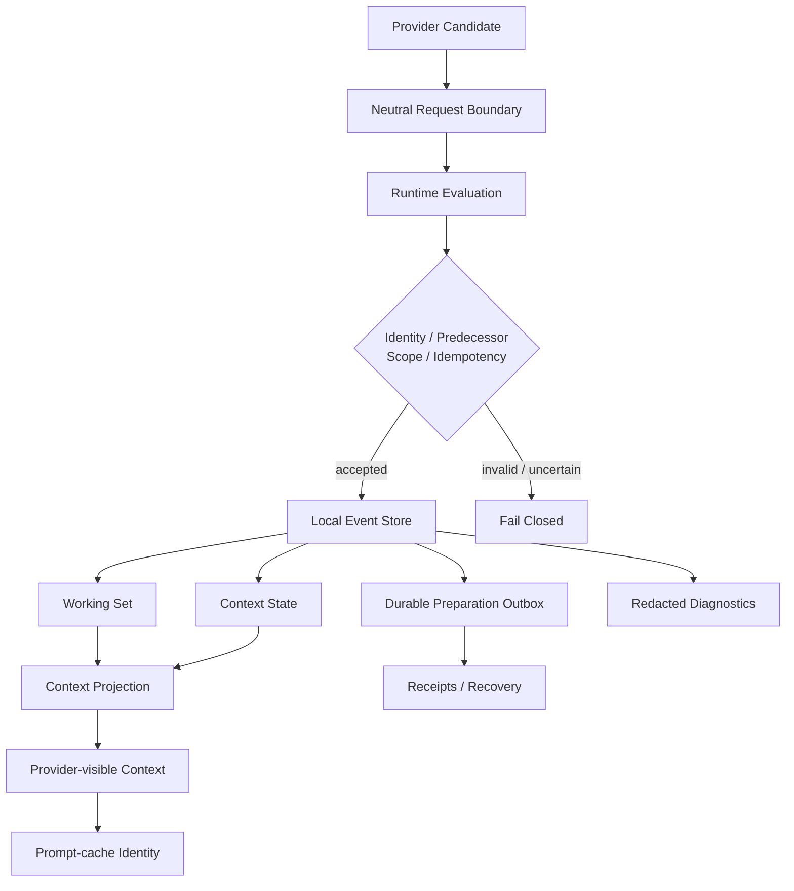

<div align="center">

# House of Us

### 为长期 AI 伴侣构建的连续性系统

**Local-first · Provider-neutral · Fail-closed · Auditable**

[简体中文](README.md) · [English](README_EN.md)

</div>

---

## 它解决什么问题？

聊天可以重新开始。

但如果一个 AI 要长期存在，仅仅“保存聊天记录”并不等于连续性。

模型可能更换，provider 可能变化，会话会被截断，context 会被压缩，运行时可能失败或重启；与此同时，长期状态不能因为一次模型输出就被随意改写。

**House of Us** 因此把连续性（continuity）当作一个工程问题，而不是单纯的 prompt 问题：

> 模型输出提出候选，运行时决定是否接受；\
> 临时上下文可以变化，持久状态必须有身份、有前序、有作用域，也必须能够解释自己为什么发生。

M5 是这条分阶段连续性工程路线的最终生产集成与验收阶段。

本仓库保存的是 **M5 的公开作品集版本**：一套经过脱敏、可以独立阅读和运行本地测试的 continuity core。

---

## 从 M0 到 M5

这里的 “M5” 不是简单的版本号，而是 House of Us 这条分阶段连续性工程路线的最终生产集成与验收阶段。每个阶段解决不同层次的问题：从稳定基线，到安全承载，再到权威连续性、上下文生命周期、长期记忆整合，最后汇入真实生产路径。

| 阶段 | 重点 | 带来的变化 | 验证边界 |
| --- | --- | --- | --- |
| M0 | 独立重新基线 | 在健康的 Generation-1 / Standing Root 生产基础上，建立可复核的身份、闭环与证据基线。 | 部署基线与独立复核 PASS |
| M1 | 受保护的 authored carrier | 让模型输出以 candidate 进入普通 House Talk，经运行时评估后生成一次受保护的连续性操作与 durable outbox。 | 真实 Talk 路径；shadow/non-authoritative，未做权威语义应用 |
| M2 | 权威 Working Set 与跨窗口连续性 | 将连续性落到单一权威 Working Set，加入作用域、前序、原子应用、重放安全和跨窗口投影。 | local/default-off candidate；精确绑定 rehearsal，生产应用留到 M5 |
| M3 | hot / warm / cold 上下文与 compaction | 建立热上下文、温压缩 episode、冷检索历史的确定性生命周期，并保留 exact anchors。 | local/default-off candidate；通过零传输拦截证明 |
| M4 | 冻结 Memory G integration | 将 Memory G、Vault、exact recall、Sources 与 M2/M3 上下文连接，保留各自 authority、来源和边界。 | local/default-off candidate；生产整合留到 M5 |
| M5 | 生产集成与最终验收 | 将 M2/M3/M4 的 producer bridges 与经过复核的修正接入生产，完成 live validation、final acceptance 与授权后的默认激活。 | live proof、独立最终复核、激活后的基线冻结 |

---

## M5 做了什么？

### 01 · 把模型输出和系统事实分开

Provider 返回的内容首先是 **candidate**，而不是可以直接写入长期状态的事实。

候选内容进入 runtime evaluation 后，只有满足相应契约与权限条件的变化才能继续进入 durable state。

这使 provider transport 与 House 自身语义保持分离，也让底层模型/provider 可以变化，而不必把系统规则一起交给模型控制。

### 02 · 给每次状态变化一个可追踪身份

M5 为持久化操作建立了明确的：

- operation identity
- predecessor binding
- scope
- idempotency
- receipts

重复请求不会因为“又执行了一次”而制造第二份事实；错误的前序关系也不会被静默接受。

恢复逻辑采用 **fail-closed** 原则：当系统无法证明某次状态变化是安全的，它宁愿停止，也不会猜。

### 03 · 把 continuity 落到持久状态，而不是只留在 prompt 里

本地 SQLite 状态包含事件、工作集（Working Set）、上下文投影与 durable preparation outbox 等结构。

Context 不再只是一次请求前临时拼起来的一大段文字，而是由持久状态经过确定性规则形成的 provider-visible projection。

换句话说：

**记忆是什么**、**当前应该看到什么**、**最终送给模型什么**，是三个可以分别检查的层次。

### 04 · 让 prompt cache 绑定真正发送出去的内容

Prompt-cache identity 根据最终 provider-facing material 生成，而不是依赖“这段内容大概没变”之类的语义判断。

只要实际送往 provider 的稳定材料不同，cache identity 就会随之变化。

这让缓存成为可以验证的运行时行为，而不是隐式优化。

### 05 · 可观察，但不把私密数据顺手写进日志

M5 的 observability 与 redaction contract 会区分：

- 可以用于诊断的结构化信息；
- 不应该进入普通 trace 的凭据；
- 不应该进入诊断信息的原始私密 body。

系统需要能够解释自己发生了什么，但“可调试”不应以泄露原始上下文为代价。

---

## 架构概览


更详细的边界与组件关系见：

- [Architecture](docs/ARCHITECTURE.md)
- [M5 Overview](docs/M5_OVERVIEW.md)
- [Public Scope](docs/PUBLIC_SCOPE.md)

---

## 我在这个项目里做什么？

House of Us 采用的是 **human-directed, AI-assisted engineering**。

Astel 负责：

- 需求定义与系统目标；
- 架构取舍与模块边界；
- 隐私与安全约束；
- 功能优先级；
- acceptance criteria；
- 测试策略与验收设计；
- failure analysis；
- 多轮修复后的独立复核与最终验证；
- 多个 AI coding agents 之间的任务拆分与工程推进。

Codex 等 AI coding agents 则在这些边界内完成具体实现、测试、文档、机械性重构与验证工作。

因此，这个项目想展示的并不是“一个人手写了多少行代码”，而是一件更接近 AI-native 产品开发的问题：

> **能否把一个模糊、长期、容易失控的需求，持续拆成明确的系统约束、可实现任务和可证明的验收结果，并借助 AI agents 把它真正做出来。**

---

## 验证

公开 M5 snapshot 在导出并脱敏后重新执行了本地测试：

**147 passed · 1 skipped · 0 failed**

同时通过：

- Python compilation
- `git diff --check`
- Markdown link verification
- public-tree disclosure scan
- credential / private-key / JWT pattern scan
- final published-clone review

公开测试只依赖 Python 标准库，不调用 provider、网络、生产环境或私有 House 数据。

### Windows PowerShell
```powershell
$env:PYTHONPATH = "src;tests"
py -3.14 -m unittest discover -s tests -p "test_*.py"
```

### macOS / Linux
```bash
PYTHONPATH=src:tests python3 -m unittest discover -s tests -p 'test_*.py'
```

---

## 为什么叫 “House of Us”？

这是一个长期 AI companion 系统，而不是一次性的聊天 demo。

所以它需要的不只是“记得更多”，而是一套能让长期状态有边界、有来源、有恢复路径，也有机会随着系统继续生长的基础设施。

M5 解决的是其中最底层的一部分：

**让 continuity 从一种感觉，变成可以被运行时检查的结构。**

---

## Public snapshot

这个仓库是冻结 M5 的 **sanitized portfolio snapshot**，而不是完整的私有 House 部署。

为了保护私有数据与生产环境，公开版本不包含真实对话/Memory 数据、provider 凭据与 traces、生产配置、私有 gateway/UI、Android relay、运行数据库、canonical Git history，以及后续的 POST-M5 / W1 开发。

完整公开边界见 [PUBLIC_SCOPE.md](docs/PUBLIC_SCOPE.md)。

---

## License

本作品集快照不授予开源许可证，**All rights reserved**。

仓库中涉及的第三方 MIT 许可组件已保留相应署名与声明，见 [THIRD_PARTY_NOTICES.md](THIRD_PARTY_NOTICES.md)。
