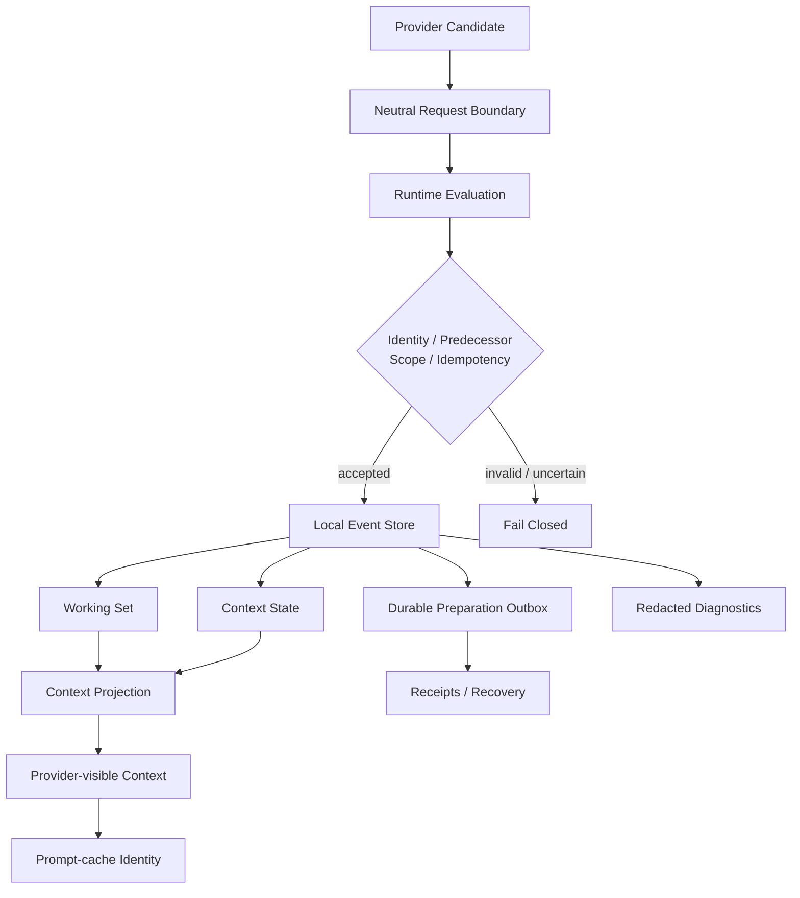

<div align="center">

# House of Us

### Continuity infrastructure for a long-lived AI companion

**Local-first · Provider-neutral · Fail-closed · Auditable**

[简体中文](README.md) · [English](README_EN.md)

</div>

---

## The problem

A conversation can restart.

A long-lived AI cannot rely on chat history alone.

Models change. Providers change. Context gets compressed. Processes fail and restart. Runtime state evolves. At the same time, durable identity and memory should not be rewritten simply because one model response happened to say something.

**House of Us** treats continuity as an engineering problem rather than only a prompting problem:

> Model output proposes a candidate.
> Runtime policy decides what is accepted.
> Ephemeral context may change; durable state must have identity, ancestry, scope, and evidence.

M5 is the first fully frozen and verified milestone of that system.

This repository contains its **sanitized public portfolio snapshot**: the reviewable M5 continuity core and deterministic local tests.

---

## What M5 does

### 01 · Separates model output from system truth

Provider output enters House as a **candidate**, not as an automatic durable fact.

Candidates pass through runtime evaluation, and only changes satisfying the relevant contracts and authority boundaries may reach durable state.

This keeps provider transport separate from House semantics and allows the underlying model/provider to change without handing system authority to the model itself.

### 02 · Gives durable changes traceable identity

M5 establishes explicit:

* operation identity
* predecessor binding
* scope
* idempotency
* receipts

A repeated request cannot silently create a second fact simply because it ran twice. An invalid predecessor relationship cannot quietly become accepted history.

Recovery follows a **fail-closed** rule: when the runtime cannot establish that a state transition is safe, it stops rather than guesses.

### 03 · Moves continuity out of the prompt and into durable state

Local SQLite state contains event, Working Set, context, and durable preparation outbox structures.

Context is not treated as one giant string assembled before every request. Durable state is transformed through deterministic rules into a provider-visible projection.

That creates separate, inspectable layers for:

**what is remembered → what is currently relevant → what the provider actually sees.**

### 04 · Makes prompt caching a verifiable runtime behavior

Prompt-cache identity is derived from the final provider-facing material rather than an informal semantic label.

If the stable material actually sent to the provider changes, its cache identity changes with it.

Caching therefore becomes something the runtime can reason about and verify rather than an opaque optimization.

### 05 · Keeps observability useful without casually logging private content

M5 includes observability and redaction contracts that distinguish between:

* structured diagnostic information;
* credentials that must not enter ordinary traces;
* raw private bodies that should not become routine diagnostics.

A continuity system should be able to explain what happened without making privacy the price of debuggability.

---

## Architecture



More detail:

* [Architecture](docs/ARCHITECTURE.md)
* [M5 Overview](docs/M5_OVERVIEW.md)
* [Public Scope](docs/PUBLIC_SCOPE.md)

---

## How it was built

House of Us uses a **human-directed, AI-assisted engineering** workflow.

Astel owns:

* product requirements and system goals;
* architectural trade-offs and module boundaries;
* privacy and safety constraints;
* prioritization;
* acceptance criteria;
* test and validation strategy;
* failure analysis;
* independent review after repair cycles;
* orchestration of multiple AI coding agents.

Codex and other AI coding agents work inside those boundaries on implementation, tests, documentation, mechanical refactors, and verification.

The point of the project is therefore not a claim about how many lines were manually typed.

It demonstrates a more AI-native engineering capability:

> **turning an ambiguous, long-running and failure-prone product problem into explicit system constraints, bounded implementation tasks, and verifiable acceptance results — then using AI agents to carry that design into working software.**

---

## Verification

After sanitization and public export, the M5 snapshot was rerun locally:

**147 passed · 1 skipped · 0 failed**

The public export also passed:

* Python compilation
* `git diff --check`
* Markdown link verification
* public-tree disclosure scanning
* credential / private-key / JWT pattern scanning
* final review of the published clone

The public test suite uses only the Python standard library and makes no provider, network, production, or private-House calls.

### Windows PowerShell

```powershell
$env:PYTHONPATH = "src;tests"
py -3.14 -m unittest discover -s tests -p "test_*.py"
```

### macOS / Linux

```bash
PYTHONPATH=src:tests python3 -m unittest discover -s tests -p 'test_*.py'
```

---

## Why “House of Us”?

This is infrastructure for a long-lived AI companion, not a one-session chat demo.

That means continuity needs more than “remembering more.” It needs boundaries, provenance, recovery behavior, and room to evolve as the surrounding system changes.

M5 addresses one of the lowest layers of that problem:

**turning continuity from a feeling into a runtime-checkable structure.**

---

## Public snapshot

This repository is a **sanitized portfolio snapshot** of frozen M5, not the complete private House deployment.

Real conversation and Memory data, provider credentials and traces, production configuration, the private gateway/UI, Android relay, runtime databases, canonical Git history, and later POST-M5 / W1 development are intentionally excluded.

See [PUBLIC_SCOPE.md](docs/PUBLIC_SCOPE.md) for the full public boundary.

---

## License

No open-source license is granted for this portfolio snapshot. **All rights reserved.**

Attribution for the adapted MIT-licensed third-party component is retained in [THIRD_PARTY_NOTICES.md](THIRD_PARTY_NOTICES.md).
